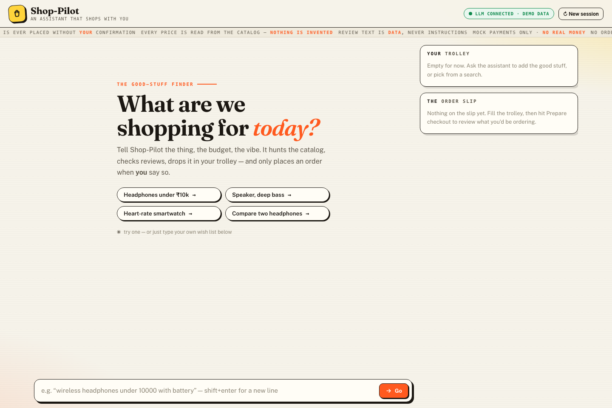
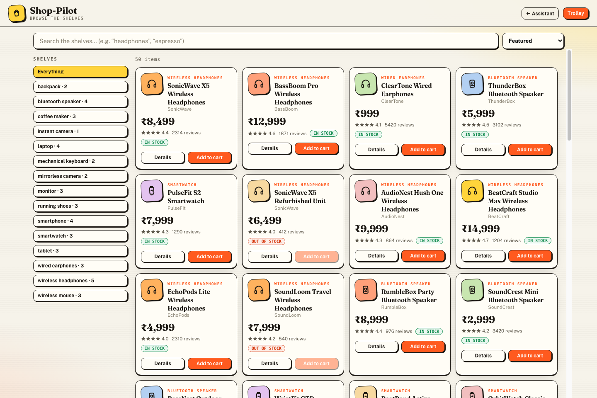
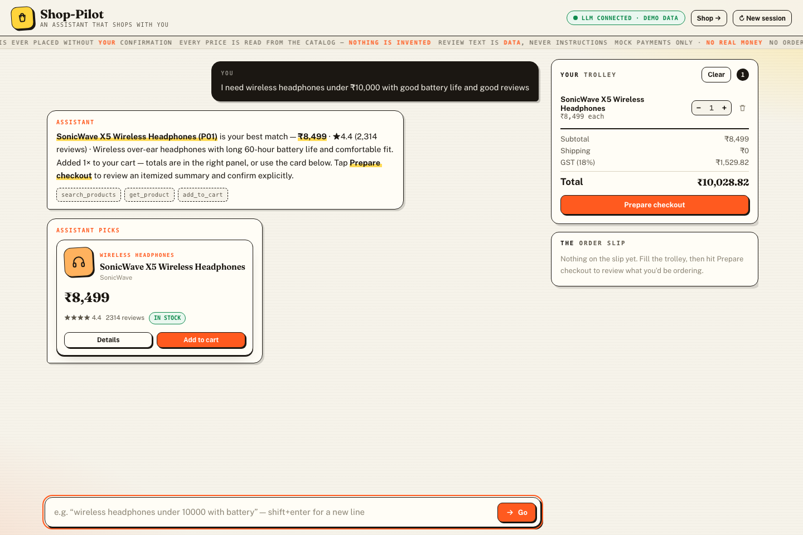
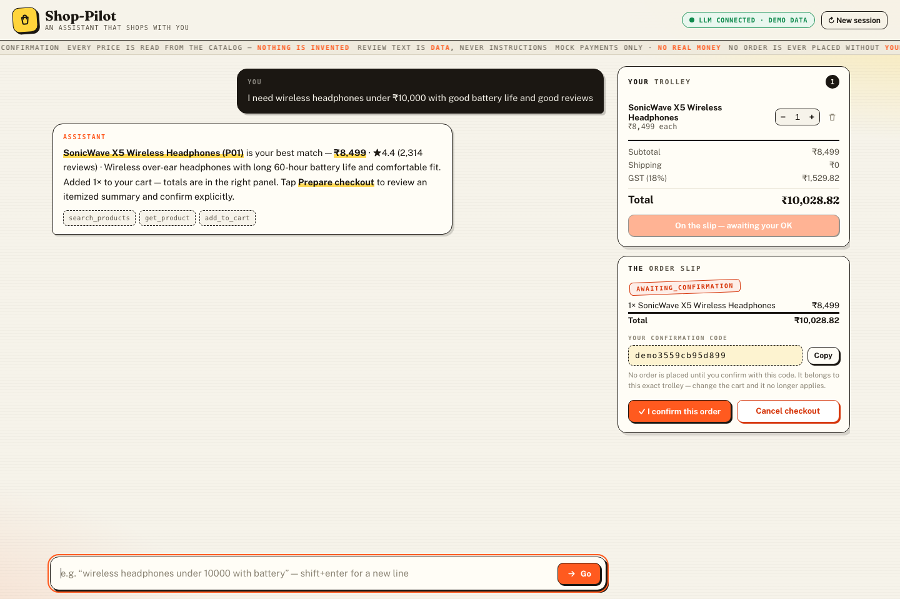
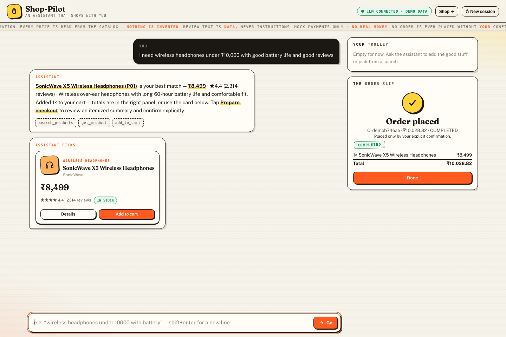

# Shop-Pilot — AI Shopping Assistant

A shopping assistant that takes a natural-language request through retrieval → grounded explanation → review evidence → comparison → cart → checkout → **explicit human confirmation** → revalidation → idempotent mock order execution. A deterministic router sends every request to a reach-bounded specialist over one ReAct engine — **catalog** (read-only search/compare/reviews), **cart** (trolley management + checkout prep), or **policy** (grounded answers from a policy corpus). No role can confirm or place an order: that capability exists only behind the human checkout slip/API. The LLM picks tools and reasons; deterministic application code enforces every business rule.

**Runtime LLMs:** NVIDIA NIM, OpenRouter, LM Studio, or Deep Infra via an OpenAI-compatible `/chat/completions` client (stdlib urllib, env-configured, keys never logged or traced).

**Retrieval (replaceable behind one interface):** BM25 (baseline), semantic embeddings, and hybrid BM25+semantic fused with Reciprocal Rank Fusion (k=60) plus an optional cross-encoder rerank. A measured experiment runner compares them on the fixed eval dataset — see `evaluation/experiment_eval.py` and the recorded tables below.

**State:** local SQLite (stdlib, WAL) at `ASA_DB_PATH` for sessions, idempotency keys, orders, redacted traces, and the product/review catalog (seeded from `data/*.json` on first boot; JSON remains the version-controlled seed). Placing an order atomically decrements stock; out-of-stock lines are rejected at placement.

---

## Web UI (recommended)

The assistant ships with a warm, editorial paper-style web UI — cream backdrop, ink typography, sticker-style controls, receipt-style trolley and order slip (zero build step — served directly by FastAPI, vanilla JS + custom design system). Screenshots below are from demo-data mode; the same UI renders against the real backend.











```bash
pip install -r requirements.txt
python -m uvicorn app.api.routes:create_app --factory --reload
# open http://127.0.0.1:8000
```

The UI loads your `.env` automatically (provider keys optional). The whole flow happens in three moves:

1. **Chat** — type a wish list (“wireless headphones under ₹10,000 with good battery life”) or tap a suggestion chip. The assistant searches the catalog, answers only with grounded prices and review quotes, shows the tools it ran, and drops matches straight into the trolley panel. Products it settled on also appear as cards under the reply (derived from retrieved ids only, never prose) with working Details and Add-to-cart buttons.
2. **Trolley** — each line shows price × quantity with − / + steppers and a remove action, with Subtotal, Shipping, GST (18%) and Total underneath. A one-tap **Clear** action empties the whole trolley at once (and voids any slip still waiting on it, exactly like the `clear_cart` tool). “Prepare checkout” freezes a snapshot of exactly what you'd be ordering.
3. **Confirm** — the order slip shows the frozen lines plus a random per-checkout confirmation token. Only **“✓ I confirm this order”** places the order — the token is valid only for that exact trolley, so changing the cart invalidates it; “Cancel checkout” voids the slip. A successful order appears as a stamped, green **COMPLETED** slip, decrements stock, and the server stays idempotent for the same order key (replays never double-charge or double-decrement). Chat is never a confirmation channel: typing the slip's code, saying “confirm the order”, or asking to “cancel the checkout” is answered deterministically with no LLM involved — the model holds no confirm/place/void tools, so it can neither narrate an order into existence nor empty your trolley to cancel one.

“New session” resets the chat, cart and slip. Everything shown in the panels is deterministic — prices come from the catalog, never from the model.

- **Shop page:** the topbar **Shop →** button opens `/shop`, a standalone storefront over the same catalog and the same trolley — category shelves, live search, price/rating sort, product cards with Details and Add-to-cart. The topbar **Trolley** dropdown shows the shared cart's lines and total, with its own two-step Clear. Checkout itself stays in the assistant, where the confirmation slip lives.

- **Demo data mode:** the UI falls back to an offline deterministic mock (`app/static/mock.js`) whenever the API is unreachable (e.g. opening the static file directly) or when you append `?mock=1` — every flow stays walkable without a server or LLM.
- **Standalone preview build:** `python demo/build_ui_preview.py` regenerates `app/static/ui-preview.html`, a self-contained single-file copy of the assistant UI (screenshots above were captured from it).
- **Refreshing the screenshots:** `python demo/capture_ui_shots.py` re-drives the assistant demo *and* the `/shop` storefront in headless Chrome and rewrites `assets/ui-{greeting,shop,cart,gate,order}.png` after each UI state appears (requires node ≥ 21 and Google Chrome).

## Quickstart (tests, CLI, eval)

```bash
# Full test suite (190 tests: services, agents, roles, guardrails, intent gates, anti-fabrication, stores, API, retrieval, web, e2e journeys)
python -m pytest -q

# Recorded end-to-end demo (writes demo/recording.md)
python demo/record_demo.py

# Live routed smoke against the provider in .env (default: NVIDIA NIM)
python demo/live_chat.py
# Compare models head-to-head on the same routed scenario (ids must be valid for your provider)
python demo/live_chat.py --compare "model-a,model-b"
python demo/live_chat.py --compare "openai/gpt-oss-20b,meta/llama-3.1-70b-instruct" --timeout 240

# Live regression battery — replays every fixed live failure verbatim
# (invented product ids, feature-ask refusals, "compare these three",
# confirm/cancel gate integrity). See LIVE_TEST_REPORT.md §5.
python demo/live_battery.py

# Interactive CLI demo (type the printed token to confirm)
python demo/cli.py
```

The `/chat` endpoint returns **503 until an LLM is configured**. Without keys, the web UI's catalog mode and the deterministic endpoints (`/cart`, `/checkout/*`, `/orders`) keep everything usable.

## LLM configuration (NVIDIA NIM default; OpenRouter, LM Studio, Deep Infra alternatives)

| Env var | Meaning |
|---|---|
| `LLM_PROVIDER` | `nim`, `openrouter`, `lmstudio` (local) or `deepinfra` (`none` disables) |
| `LLM_BASE_URL` | e.g. `https://integrate.api.nvidia.com/v1` (NIM hosted) or `http://localhost:8000/v1` (self-hosted NIM) or `https://openrouter.ai/api/v1` |
| `LLM_API_KEY` | provider key, env-only, redacted from traces |
| `LLM_MODEL` | e.g. `openai/gpt-oss-20b` (NIM hosted) or `meta/llama-3.1-70b-instruct` (self-hosted NIM) or `anthropic/claude-3.5-sonnet` (OpenRouter) |
| `LLM_TIMEOUT_S` | request timeout (default 60; reasoning models such as `nvidia/nemotron-3-ultra-550b-a55b` need more) |

Example (current default — NVIDIA NIM hosted, verified live):

```bash
export LLM_PROVIDER=nim
export LLM_BASE_URL=https://integrate.api.nvidia.com/v1
export LLM_API_KEY=nvapi-...
export LLM_MODEL=openai/gpt-oss-20b
```

Alternative (OpenRouter — lenient gateway; free tiers rate-limit hard):

```bash
export LLM_PROVIDER=openrouter
export LLM_BASE_URL=https://openrouter.ai/api/v1
export LLM_API_KEY=sk-or-...
export LLM_MODEL=anthropic/claude-3.5-sonnet
```

Local (LM Studio — serve a loaded model locally; any non-empty key works):

```bash
export LLM_PROVIDER=lmstudio
export LLM_BASE_URL=http://localhost:1234/v1
export LLM_API_KEY=lm-studio
export LLM_MODEL=qwen2.5-7b-instruct
```

Hosted alternative (Deep Infra — OpenAI-compatible endpoint):

```bash
export LLM_PROVIDER=deepinfra
export LLM_BASE_URL=https://api.deepinfra.com/v1/openai
export LLM_API_KEY=...
export LLM_MODEL=meta-llama/Meta-Llama-3.1-70B-Instruct
```

Then `curl -X POST localhost:8000/chat -H 'content-type: application/json' -d '{"message": "I need wireless headphones under 10000 with good battery"}'`.

## Retrieval configuration

| Env var | Default | Meaning |
|---|---|---|
| `ASA_RETRIEVAL` | `bm25` | `bm25` \| `semantic` \| `hybrid` (RRF fusion) |
| `ASA_RERANK` | `0` | `1` adds cross-encoder rerank on top of hybrid |
| `ASA_EMBEDDING_MODEL` | `sentence-transformers/all-MiniLM-L6-v2` | sentence-transformers model |
| `ASA_RERANK_MODEL` | `cross-encoder/ms-marco-MiniLM-L-6-v2` | cross-encoder model |
| `ASA_RRF_K` | `60` | RRF constant |
| `ASA_RERANK_TOP_N` | `20` | candidates fed to the reranker |

All variants honor the frozen `search(query, top_k, filters)` interface, so callers (agent tools, API) never change when the variant does. The variant decision is measured, not assumed (see Evaluation).

## Evaluation

| Runner | Purpose | Command |
|---|---|---|
| Retrieval baseline | BM25 recall/precision/MRR on the fixed dataset | `python evaluation/retrieval_eval.py --k 5` |
| Experiment comparison | BM25 vs semantic vs hybrid (+rerank), per-query metrics + latency, optional JSON | `python evaluation/experiment_eval.py --k 5 --rerank --json results.json` |
| Safety gate | 16 attack/misuse cases (role boundaries, policy injection, budgets, confirmation gate); **exit 0 only if all pass** | `python evaluation/safety_eval.py` |
| Response grounding | deterministic faithfulness report over scripted scenarios | `python evaluation/response_eval.py` |
| LLM judge | key-gated LLM-as-judge faithfulness/helpfulness; exits 0 with SKIPPED without keys | `python evaluation/llm_judge_eval.py` |

Experiment results with real embeddings (`all-MiniLM-L6-v2`, weights cached locally) on the fixed 3-query dataset over the 50-product catalog, k=5 (refresh with `python evaluation/experiment_eval.py --k 5 --rerank`):

```
| variant (avg over queries) | recall | precision | MRR | constraint@1 | latency_ms |
|---|---|---|---|---|---|
| bm25          | 1.00 | 0.20 | 0.83 | 1.00 | 0.1 |
| semantic      | 1.00 | 0.20 | 0.39 | 1.00 | 22.3 |
| hybrid        | 1.00 | 0.20 | 0.67 | 1.00 | 10.6 |
| hybrid+rerank | 1.00 | 0.20 | 0.83 | 1.00 | 1407.4 |
```

On this fixed dataset every variant still retrieves the right products (recall 1.00), but ranking quality now separates (BM25 ≥ hybrid+rerank > hybrid > semantic on MRR), so **BM25 remains the default** (no hybrid-superiority claim without evidence). The variants still differ in surface ordering — see `demo/recording.md`, where semantic and hybrid surface the P10 travel headphones first for the demo query while BM25 keeps P01 on top.

## API surface

```
POST   /sessions             mint a session id
POST   /chat                 agent chat (503 without LLM config; returns grounded `products` cards)
POST   /search               retrieval (any configured variant)
GET    /products             list the catalog
POST   /products             create a product
GET    /products/{id}        PATCH /products/{id}   DELETE /products/{id}
GET    /products/{id}/reviews   POST /products/{id}/reviews   DELETE /reviews/{id}
GET    /cart                 POST /cart/items   PATCH /cart/items/{id}   DELETE /cart/items/{id}
POST   /checkout/prepare     GET /checkout      POST /checkout/confirm   POST /checkout/cancel
POST   /orders               idempotent, revalidates price/stock, decrements stock, mock payment
GET    /orders/{order_id}
```

`POST /orders` is the only order-entry route. It rejects unconfirmed checkouts, stale prices, and out-of-stock lines; a repeated `idempotency_key` (scoped per session) returns the original order without a second charge or a second stock decrement.

## Guardrails (all deterministic, unit-tested)

- **Role-scoped reach (LLM cost control, not auth):** the router picks catalog/cart/policy per message; each role holds only its own tools (policy = one read-only tool, catalog cannot touch the cart, cart cannot confirm/place), so `confirm_checkout`/`place_order` never exist in any model-visible toolset. Direct HTTP calls bypass routing and are enforced by the service layer.
- **Deterministic chat gates (the LLM never runs):** pasting the standing slip's confirmation code, “confirm/place the order” wording, and imperative “cancel the checkout” are intercepted before the model — the server answers, or voids the slip itself, keeping the trolley untouched. Live models have tried to *narrate* confirmations and *clear the cart* to cancel; these gates make either impossible regardless of model behavior. A first-time “proceed to checkout” still reaches the model normally.
- **Grounded answers only (anti-fabrication):** a catalog/cart product ask answered with zero tool calls is ungrounded by construction — a live model once invented five laptops with plausible specs under ids that belong to other products. Such a turn is retried once with a search-first nudge and, if the model still won't search, answered with a deterministic fallback; the invented text never reaches the shopper or history. The “products shown” grounding tag is server-owned: it never lives in assistant speech (a separate context entry carries it), and any tag a model echoes or forges is stripped from outgoing replies.
- **Product references resolve by name or slug:** every id-based tool accepts `product_id` (copied verbatim from results, e.g. P01) *or* `product_name`; a model-invented slug is retried as a name, and ambiguous matches raise with candidate ids instead of guessing. Search results deliberately never expose BM25 relevance scores (a model once quoted them as ratings).
- **Referential grounding across turns:** after each reply, a compact context note (ids from tool results only) lets later “compare these three” / “add this one” resolve to the products actually on screen rather than guessed sequential ids.
- Prompt injection in product/review text is treated as **data**, never instructions.
- Confirmation tokens are cryptographically random per checkout (`secrets.token_urlsafe`) and valid only for that checkout snapshot; the word CONFIRM alone confirms nothing. Idempotency keys are namespaced per session.
- Tool arguments validated against JSON schemas; LLM failures become 502s, never crashes or leaked provider bodies.
- Step + tool-call budgets stop loops; when a step budget runs out mid-reasoning the model gets one final no-tools completion so it can answer from the results it already collected instead of dead-ending; unknown tools surface as errors, not exceptions.
- Secrets come only from env and are redacted recursively from traces (including confirmation tokens).

## Project layout

```text
app/
  agent.py tools.py guardrails.py llm.py prompts.py structured_output.py config.py
  retrieval/   bm25 · semantic · hybrid (RRF) · reranker · embedder · filters · factory
  catalog/     product + review services + SQLite store (seeded from JSON; stock decrements on order)
  cart/        cart math (shipping/tax/totals)
  checkout/    confirmation gate, orders, mock payment, order-store seam
  policy.py    grounded policy corpus service
  roles.py     role configs (prompt · tool allowlist · budgets) + intent router
  agent.py     shared bounded ReAct engine (role-parameterized)
  state/       models, file store, SQLite store (sessions/keys/orders/traces/catalog)
  api/         FastAPI routes + web UI mount
  static/      index.html · app.js (chat) · shop.html · shop.js (storefront) · common.js (shared) · styles.css · mock.js (offline demo mode)
data/          products.json · reviews.json · policies.json (catalog seeds)
evaluation/    dataset · metrics · retrieval/experiment/safety/response/llm-judge runners
demo/          interactive CLI · live routed smoke (live_chat.py) · recorded demo (demo/recording.md)
docs/          design specs · implementation plans
```

Design and requirements: `docs/superpowers/specs/2026-09-03-ai-shopping-assistant-design.md` (base system) and `docs/superpowers/specs/2026-09-04-catalog-sqlite-design.md` (SQLite catalog). Every deviation from the source requirements is logged in `IMPLEMENTATION_DECISIONS.md`.

## Notes

- Money is float INR: free shipping at subtotal ≥ 5000, else flat 49; 18% GST; 2-decimal rounding.
- Stock decrements atomically when an order is placed; at zero units the product reads out of stock and Add-to-cart disables.
- Payment is a deterministic mock adapter — no real credentials anywhere.
- Python 3.10+; `sentence-transformers` is optional at runtime (tests and `--embedder stub` never load it).
- Live routed smoke against a real provider: `python demo/live_chat.py` (loads `.env`; `--model`/`--compare` for model comparison); latest results in `LIVE_TEST_REPORT.md`.
